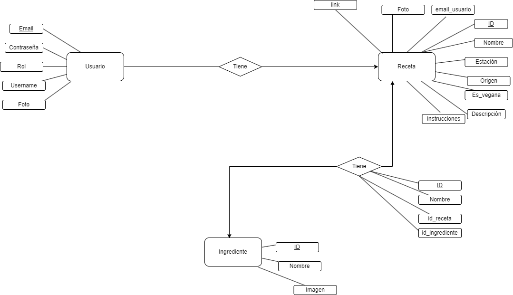

# Wa2Eat

## Requisitos iniciales (Primera reunión con el cliente)
- **Registro de usuarios:** La página debe permitir a los usuarios registrarse y crear una cuenta para poder utilizar las funciones de la página. Los usuarios deben poder crear un perfil con información personal básica como su nombre y dirección de correo electrónico.
- **Función de ingreso de recetas:** La página debe permitir a los usuarios ingresar recetas con los ingredientes de cada una. Además, se tendrá la opción de añadir características adicionales para la receta, como la elaboración o el origen de la misma.
- **Filtros de búsqueda:** La página debe contar con diferentes filtros de búsqueda para que los usuarios puedan buscar recetas por temporada, país de origen, tipo de comida, etc. Esto ayudará a los usuarios a encontrar recetas específicas que se ajusten a sus necesidades.
- **Función de búsqueda de recetas:** La página debe contar con una función que permita a los usuarios buscar recetas que se encuentren disponibles.
- **Recetas detalladas:** Cada receta debe contar con una lista detallada de ingredientes, pasos a seguir y recomendaciones para la presentación de la comida. Además, es importante que se incluyan fotografías de las recetas para que los usuarios puedan ver cómo debe quedar la comida final.
- **Diseño y navegación:** Es importante que la página tenga un diseño atractivo y una navegación sencilla e intuitiva. Esto facilitará la búsqueda y el uso de las diferentes funciones de la página para los usuarios.

## Modelo entidad relación inicial

### Enlace a prototipo en marvel
https://marvelapp.com/prototype/j93e5e4
